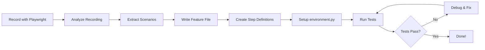

# 🔄 Playwright Recording to BDD Conversion Guide

## ⚡ TL;DR (3-Line Summary)

1. **Problem**: Playwright recordings generate raw Python code that isn't in BDD (Behavior-Driven Development) format
2. **Impact**: Tests lack readability, reusability, and business-friendly scenarios
3. **Fix**: Convert recordings to Gherkin feature files with proper step definitions and Page Objects

---

## 📋 Table of Contents

1. [Understanding the Problem](#understanding-the-problem)
2. [The Conversion Process](#the-conversion-process)
3. [Step-by-Step Example](#step-by-step-example)
4. [Best Practices](#best-practices)
5. [Common Pitfalls](#common-pitfalls)
6. [Complete Example Files](#complete-example-files)

---

## 🔍 Understanding the Problem

### What You Get from Playwright Codegen

When you record tests using Playwright's codegen tool, you get a raw Python script:

```python
# Raw Playwright recording
from playwright.sync_api import sync_playwright

def run():
    with sync_playwright() as p:
        browser = p.chromium.launch(headless=False)
        page = browser.new_page()
        page.goto("https://example.com")
        page.click("text=Login")
        page.fill("#username", "testuser")
        page.click("button:has-text('Submit')")
        browser.close()
```

### What's Wrong with This?

❌ **Not readable by non-technical stakeholders**
❌ **Hard to maintain** - Selectors mixed with logic
❌ **Not reusable** - Steps can't be shared across tests
❌ **No clear test intent** - What are we testing?
❌ **Tight coupling** - Changes to UI require changing all tests

### What You Need (BDD Format)

✅ **Human-readable scenarios** in Gherkin syntax
✅ **Reusable step definitions** that can be shared
✅ **Page Object Model** for better maintainability
✅ **Clear separation** between test intent and implementation
✅ **Business-friendly** language that stakeholders understand

---

## 🔄 The Conversion Process

### Step 1: Analyze the Recording

Read through the Playwright recording and identify:

1. **Actions** - What is the user doing?
2. **Verifications** - What are we checking?
3. **Flow** - What's the logical sequence?
4. **Scenarios** - What distinct test cases exist?

### Step 2: Extract Test Scenarios

Group related actions into logical scenarios:

```python
# Recording shows:
1. Navigate to homepage
2. Click "Checkboxes" link
3. Check first checkbox
4. Uncheck second checkbox
5. Verify states

# This becomes a scenario:
Scenario: Successfully interact with checkboxes
```

### Step 3: Write Gherkin Feature File

Convert the flow into Given-When-Then format:

```gherkin
Feature: Checkbox Interaction

  Scenario: Successfully interact with checkboxes
    Given I navigate to the Herokuapp homepage
    When I click on the "Checkboxes" link
    And I check the first checkbox
    And I uncheck the second checkbox
    Then the first checkbox should be checked
    And the second checkbox should be unchecked
```

### Step 4: Create Step Definitions

Implement the Gherkin steps in Python:

```python
@when('I check the first checkbox')
def step_check_first_checkbox(context):
    checkbox = context.page.locator("input[type='checkbox']").nth(0)
    checkbox.check()
```

### Step 5: Organize Files Properly

```
features/
├── environment.py              ← MUST be here!
├── steps/
│   └── herokuapp_steps.py
└── herokuapp.feature
```

---

## 📚 Step-by-Step Example

### Original Playwright Recording

**File**: `herokuapp_test-dample_2025-11-23.py` (see examples/bdd-conversion/)

```python
def run():
    with sync_playwright() as p:
        browser = p.chromium.launch(headless=False)
        page = browser.new_page()

        # Navigate to homepage
        page.goto("https://the-internet.herokuapp.com/")

        # Click Checkboxes
        page.click("text=Checkboxes")

        # Interact with checkboxes
        checkbox1 = page.locator("input[type='checkbox']").nth(0)
        checkbox1.check()

        checkbox2 = page.locator("input[type='checkbox']").nth(1)
        checkbox2.uncheck()

        # Navigate to Challenging DOM
        page.goto("https://the-internet.herokuapp.com/")
        page.click("text=Challenging DOM")

        # Click buttons
        page.click("a.button:has-text('foo')")
        page.click("a.button.alert:has-text('bar')")
        page.click("a.button.success:has-text('baz')")

        browser.close()
```

### Conversion Analysis

Let's break down what this recording does:

| Action | Type | What to Convert To |
|--------|------|-------------------|
| `page.goto("https://...")` | Setup | Background step: `Given I navigate to...` |
| `page.click("text=Checkboxes")` | Action | `When I click on the "Checkboxes" link` |
| `checkbox1.check()` | Action | `When I check the first checkbox` |
| `checkbox2.uncheck()` | Action | `When I uncheck the second checkbox` |
| `page.click("text=Challenging DOM")` | Action | `When I click on the "Challenging DOM" link` |
| `page.click("a.button:has-text('foo')")` | Action | `When I click the "foo" button` |

### Converted BDD Feature File

**File**: `herokuapp_test-dample_2025-11-23.feature`

```gherkin
Feature: Herokuapp Interactive Elements Testing
  As a QA tester
  I want to test various interactive elements on Herokuapp
  So that I can ensure they work correctly

  Background:
    Given I navigate to the Herokuapp homepage

  @checkboxes @smoke
  Scenario: Successfully interact with checkboxes
    When I click on the "Checkboxes" link
    Then I should see the checkboxes page
    When I check the first checkbox
    And I uncheck the second checkbox
    Then the first checkbox should be checked
    And the second checkbox should be unchecked

  @challenging-dom @buttons
  Scenario: Successfully interact with Challenging DOM buttons
    When I click on the "Challenging DOM" link
    Then I should see the Challenging DOM page
    When I click the "foo" button
    And I click the "bar" button
    And I click the "baz" button
    Then all button clicks should be successful
```

### Converted Step Definitions

**File**: `features/steps/herokuapp_steps.py`

```python
from behave import given, when, then
from playwright.sync_api import expect

@given('I navigate to the Herokuapp homepage')
def step_navigate_to_homepage(context):
    context.page.goto("https://the-internet.herokuapp.com/")

@when('I click on the "{link_text}" link')
def step_click_link(context, link_text):
    context.page.click(f"text={link_text}")

@when('I check the first checkbox')
def step_check_first_checkbox(context):
    checkbox = context.page.locator("input[type='checkbox']").nth(0)
    checkbox.check()

@when('I uncheck the second checkbox')
def step_uncheck_second_checkbox(context):
    checkbox = context.page.locator("input[type='checkbox']").nth(1)
    checkbox.uncheck()

@then('the first checkbox should be checked')
def step_verify_first_checkbox_checked(context):
    checkbox = context.page.locator("input[type='checkbox']").nth(0)
    assert checkbox.is_checked(), "First checkbox should be checked"
```

---

## 💡 Best Practices

### 1. Use Descriptive Scenario Names

❌ **Bad**:
```gherkin
Scenario: Test 1
```

✅ **Good**:
```gherkin
Scenario: Successfully interact with checkboxes
```

### 2. Write Business-Friendly Steps

❌ **Bad** (Too technical):
```gherkin
When I click on the element with selector "a.button:has-text('foo')"
```

✅ **Good** (Business language):
```gherkin
When I click the "foo" button
```

### 3. Use Background for Common Setup

❌ **Bad** (Repetitive):
```gherkin
Scenario: Test checkboxes
  Given I navigate to the homepage
  ...

Scenario: Test buttons
  Given I navigate to the homepage
  ...
```

✅ **Good** (DRY):
```gherkin
Background:
  Given I navigate to the homepage

Scenario: Test checkboxes
  ...

Scenario: Test buttons
  ...
```

### 4. Make Steps Reusable

❌ **Bad** (Specific):
```python
@when('I check the first checkbox on the checkboxes page')
def step_impl(context):
    ...
```

✅ **Good** (Generic):
```python
@when('I check the first checkbox')
def step_impl(context):
    ...
```

### 5. Use Scenario Outlines for Data-Driven Tests

❌ **Bad** (Duplicate scenarios):
```gherkin
Scenario: Click foo button
  When I click the "foo" button

Scenario: Click bar button
  When I click the "bar" button
```

✅ **Good** (Parametrized):
```gherkin
Scenario Outline: Click different buttons
  When I click the "<button>" button

  Examples:
    | button |
    | foo    |
    | bar    |
    | baz    |
```

### 6. Add Tags for Organization

```gherkin
@smoke @checkboxes
Scenario: Successfully interact with checkboxes
  ...

@regression @challenging-dom
Scenario: Test Challenging DOM buttons
  ...
```

Run specific tests:
```bash
behave --tags=smoke          # Run only smoke tests
behave --tags=@checkboxes    # Run only checkbox tests
```

### 7. Separate Setup from Testing

❌ **Bad**:
```gherkin
Scenario: Test login
  Given I open the browser          # Setup (shouldn't be here)
  When I navigate to the login page
  ...
```

✅ **Good**:
```gherkin
# In environment.py (before_scenario hook)
context.page = context.browser.new_page()

# In feature file
Scenario: Test login
  When I navigate to the login page
  ...
```

---

## 🚨 Common Pitfalls

### Pitfall 1: Not Moving environment.py

❌ **Wrong**:
```
project/
├── steps/
│   └── environment.py    ← Behave won't find this!
└── features/
```

✅ **Correct**:
```
project/
└── features/
    ├── environment.py    ← MUST be here
    └── steps/
```

### Pitfall 2: Too Many Actions in One Step

❌ **Bad**:
```python
@when('I login with valid credentials and navigate to dashboard')
def step_impl(context):
    context.page.click("text=Login")
    context.page.fill("#username", "test")
    context.page.fill("#password", "pass")
    context.page.click("button")
    context.page.wait_for_url("**/dashboard")
```

✅ **Good**:
```python
@when('I click the login link')
@when('I enter username "{username}"')
@when('I enter password "{password}"')
@when('I click the submit button')
@then('I should see the dashboard')
```

### Pitfall 3: Hard-Coded Values

❌ **Bad**:
```python
@when('I check the first checkbox')
def step_impl(context):
    context.page.click("input[type='checkbox']")  # Always clicks first one
```

✅ **Good**:
```python
@when('I check the {ordinal} checkbox')
def step_impl(context, ordinal):
    index = {"first": 0, "second": 1, "third": 2}[ordinal]
    context.page.locator("input[type='checkbox']").nth(index).check()
```

### Pitfall 4: Not Using Page Objects

❌ **Bad**:
```python
@when('I login')
def step_impl(context):
    context.page.fill("#username", "test")
    context.page.fill("#password", "pass")
    context.page.click("button")
```

✅ **Good**:
```python
class LoginPage:
    def __init__(self, page):
        self.page = page
        self.username_input = page.locator("#username")
        self.password_input = page.locator("#password")
        self.submit_button = page.locator("button")

    def login(self, username, password):
        self.username_input.fill(username)
        self.password_input.fill(password)
        self.submit_button.click()

@when('I login with "{username}" and "{password}"')
def step_impl(context, username, password):
    login_page = LoginPage(context.page)
    login_page.login(username, password)
```

---

## 📁 Complete Example Files

All example files are located in `examples/bdd-conversion/`:

### 1. Original Recording
**File**: `herokuapp_test-dample_2025-11-23.py`
- Raw Playwright recording
- Shows the actual recorded script
- Contains all actions and verifications

### 2. Converted Feature File
**File**: `herokuapp_test-dample_2025-11-23.feature`
- Proper Gherkin syntax
- Multiple scenarios extracted from recording
- Includes parametrized scenarios
- Proper tags and organization

### 3. Step Definitions
**File**: `herokuapp_test_steps.py`
- Implements all Gherkin steps
- Uses proper Playwright assertions
- Follows Page Object pattern
- Reusable step implementations

### 4. Environment Configuration
**File**: `environment.py`
- Browser setup and teardown
- Context initialization
- Hook implementations
- Screenshot capture on failure

---

## 🔄 Conversion Workflow



---

## 🎯 Checklist for Conversion

Use this checklist when converting recordings:

- [ ] Analyzed the recording and identified distinct scenarios
- [ ] Created feature file with descriptive scenario names
- [ ] Wrote steps in business-friendly language (not technical)
- [ ] Used Background for common setup steps
- [ ] Created reusable step definitions
- [ ] Implemented Page Objects for better maintainability
- [ ] Moved environment.py to features/ directory
- [ ] Added proper tags for test organization
- [ ] Used Scenario Outlines for data-driven tests
- [ ] Added proper assertions (not just actions)
- [ ] Tested that all scenarios pass
- [ ] Verified hooks are executing (check console output)
- [ ] Added screenshot capture for failures
- [ ] Documented any custom helper functions

---

## 📚 Additional Resources

- **Behave Documentation**: https://behave.readthedocs.io/
- **Gherkin Syntax**: https://cucumber.io/docs/gherkin/
- **Playwright Python**: https://playwright.dev/python/
- **Page Object Model**: https://playwright.dev/python/docs/pom

---

## 🎓 Key Takeaways

1. **Playwright recordings are a starting point**, not the end result
2. **BDD provides clarity** - Anyone can read and understand tests
3. **Proper structure matters** - environment.py MUST be in features/
4. **Reusability is key** - Write generic, reusable steps
5. **Test intent over implementation** - Focus on what, not how
6. **Page Objects improve maintainability** - Separate selectors from logic
7. **Tags enable flexible test execution** - Run subsets of tests easily

Remember: The goal is to make tests that are **readable**, **maintainable**, and **valuable** to the entire team, not just developers!
